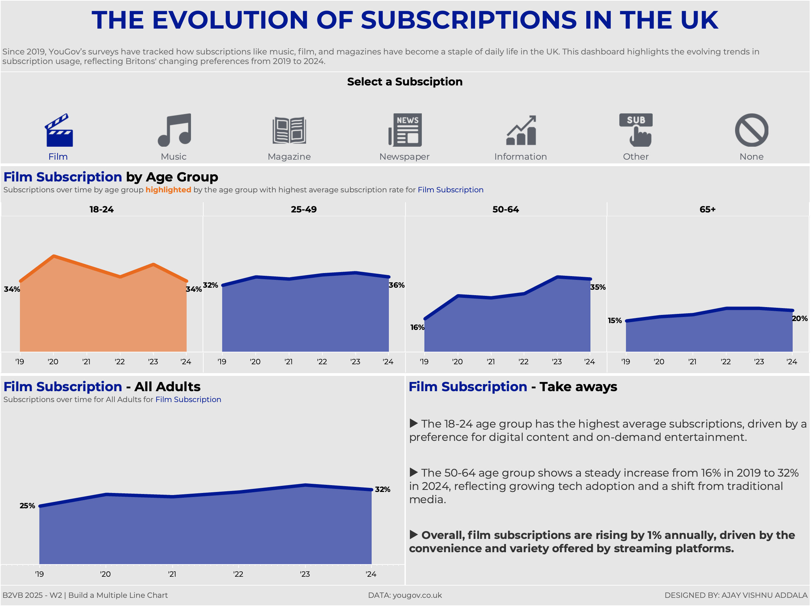

# Back to Viz Basics 2025 - Week 2: Subscription Trends in the UK

This project is part of the "Back to Viz Basics" challenge for Week 2, 2025. It explores subscription trends in the UK using YouGov survey data, focusing on how subscriptions have evolved across different age groups from 2019 to 2024.

## Key Insights
- **Film Subscriptions**: 18-24 age group leads, with a steady increase among the 50-64 demographic, reflecting the rising adoption of streaming platforms.
- **Music Subscriptions**: Subscriptions grow across all age groups, with 18-24 leading and overall subscriptions increasing from 21% to 33%.
- **Newspaper Subscriptions**: 65+ age group dominates, while other groups remain stagnant; overall stagnant at 9% due to digital alternatives.
- **No Subscriptions**: Highest among 65+, but declining overall as subscription-based services become mainstream.
- **Other Subscriptions**: Stable at 9% across all groups, reflecting niche demand.

## Data Source
The dataset includes survey data from YouGov, collected bi-annually from September 2019 to 2024. The survey asked Britons about their subscription habits across categories like music, film, newspapers, and others.

### Fields Included
- **Survey Date**: Bi-annual survey dates (2019-2024)
- **Subscription Type**: Categories like Music, Film, Magazine, etc.
- **Percentage**: Percentage of respondents subscribing to each category.
- **Base**: Weighted respondent total for demographic balance.
- **Unweighted Base**: Raw respondent total before adjustments.

## Live Visualization
Check out the interactive Tableau dashboard here: [View on Tableau Public](<Your-Tableau-Link>)
